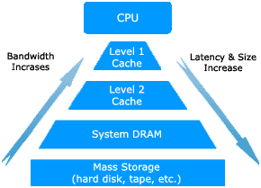
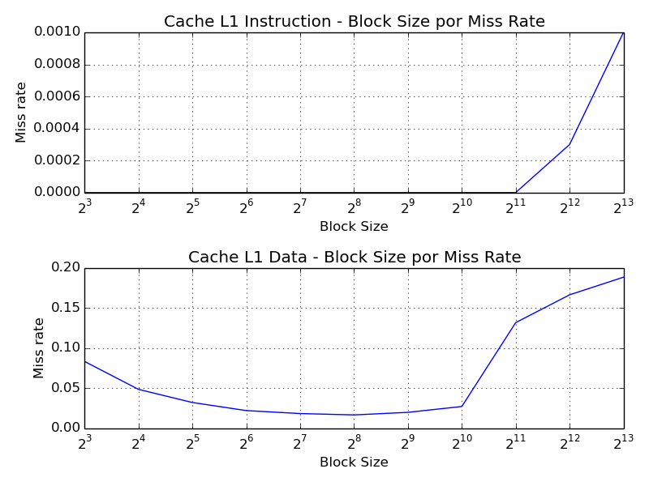
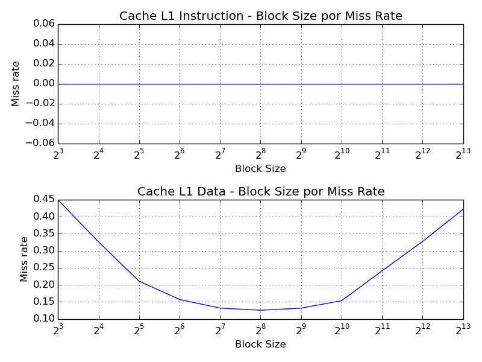
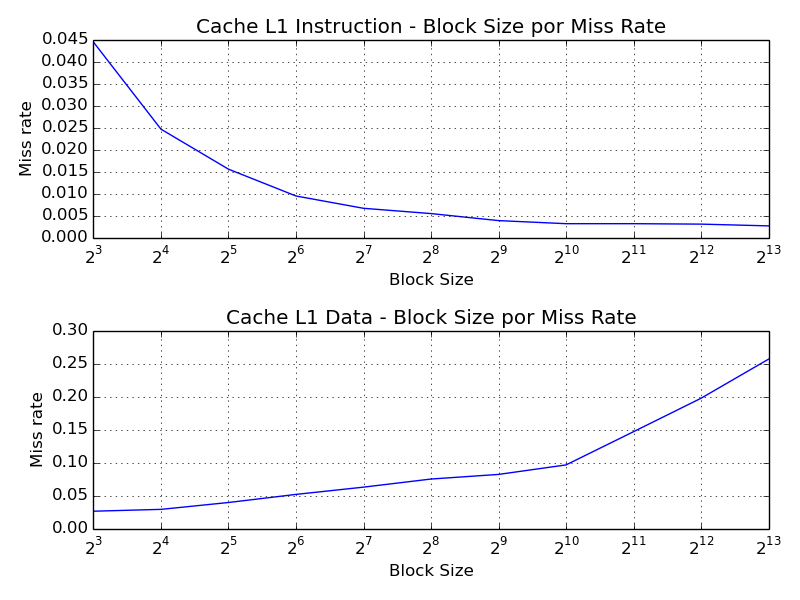
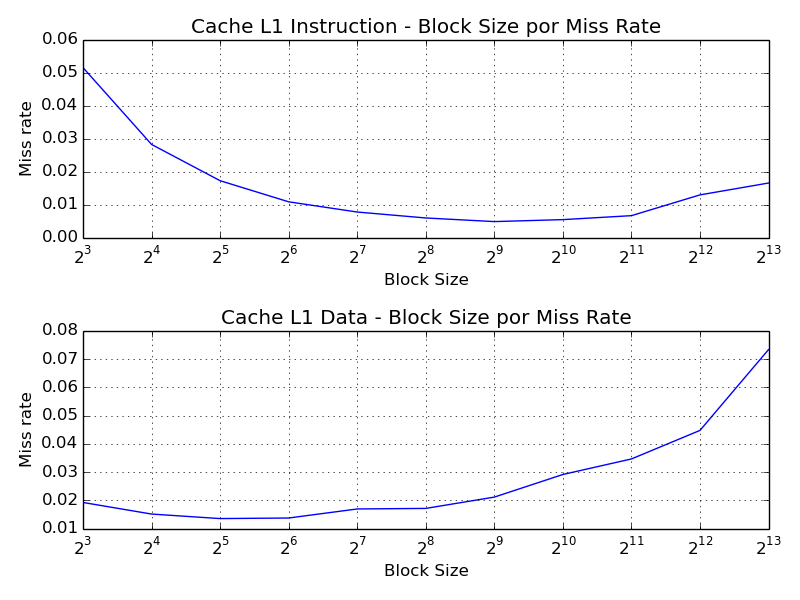

# Exercício 2: Configuração de Cache
Aluno Luiz Rodolfo Felet Sekijima

RA 117842

Para o exercício 2 de MC723 nos foi proposto fazer uma análise de diferentes configurações de cache a partir de simulações e definir a melhor configuração. O software utilizado é o dinero IV e o método escolhido para determinar a melhor configuração foi simular para 4 programas com um nível de cache (L1 de instruções e L1 de dados). Este relatório está dividido nas seguintes seções: uma explicação sobe caches, como o dinero IV funciona, descição dos scripts usados para gerar simulações e gráficos, a análise dos resultados e conclusão.


## Memória cache

A cache é um tipo de memória usado pela CPU para reduzir o tempo de acesso médio aos dados na memória principal. A cache é uma memória menor e mais rápida que armazena cópias dos dados mais frequentemente usados da memória principal. A maioria dos computadores possui caches independentes,  dividindo em cache para instruções e para dados.



A figura acima mostra a hierarquia das memória de um computador com dois níveis de cache, quanto mais próxima do topo, mais rápida é a memória, mas também é mais cara e menor. Atualmente é usado um sistema de caches multi-nível, pois caso o dado procurado não se encontre na cache, é necessário buscar este dados na memória principal, operação que é muito custosa em tempo, então são usados vários níveis de cache para que a penalidade seja abrandada. A cache L1 é a cache mais rápida e menor em capacidade. Caso o dado procurado não se encontre na cache L1 (miss), há um segundo nível de cache, o L2, de maior capacidade onde o dado talvez possa estar. A cache L2 tem velocidade de acesso mais rápido que a memória principal, logo é mais rápido que buscar na memória principal. E a mesma lógica pode ser aplicada para um terceiro nível de cache (L3) para melhorar a performance das caches L1 e L2.

### Tamanho do bloco (block size)

O tamanho do bloco indica quanta informação pode ser armazenada em cada entrada da cache, se temos uma cache com capacidade de 32Kb e o tamanho do bloco é de 32 bytes, podem ser armazenadas nesta cache 1000 entradas, ou linhas, com dados de 32 bytes em cada entrada. Um método simples de reduzir a taxa de miss é aumentar o tamanho do bloco, pois tiramos vantagem da localização espacial dos dados na memória, principalmente para instruções que normalmente estão armazenadas sequêncialmente em ordem de execução. No entanto, isto aumenta a quantidade de miss, pois blocos grandes diminuem o número de entradas. Se dobramos o tamanho do bloco, diminuimos na metade o número de entradas da cache, o que pode reduzir muito o desempenho para caches de pouca capacidade. É importante equilibrar o tamanho do bloco com a capacidade da cache.


### Associatividade da cache

A associatividade da cache está relacionada com as posições em que um dado pode ser armazenado. Em uma cache *Fully Associative*, não há possições determinadas paras os blocos, um bloco pode ser armazenado em qualquer posição da cache. Mas para caches n associativas, a cache é dividida em grupos com n entradas, uma operação de módulo determina em qual grupo cada bloco pode ser armazenado. Se a cache tem associatividade 1, cada bloco só pode ser armazenado em uma entrada da cache. Como há muito mais blocos do que entradas de cache, caches com associatividade baixa tem problema de conflito, diversos dados desejam ser armazenados na mesma posição da cache. Aumentar a associatividade reduz este conflito, mas aumenta o tempo de busca do dado na cache.


## Dinero IV

O [Dinero IV](http://pages.cs.wisc.edu/~markhill/DineroIV/) é um simulador de cache para *traces* de referência de memória. O Dinero IV não simula tempos ou ciclos de memória, ele somente indica informações de *hit* ou *miss* na memória. 

### Traces

Os traces disponibilizados para o trabalho foram coletados para a arquitetura Alpha, executando os benchmarks [SPEC CPU2000](http://www.spec.org/cpu2000/). Há dois tipos de traces, o F2B que são as 2 bilhões primeiras instruções e o M2B, 2 bilhoẽs de instruções armazenadas depois de pular 50 bilhoes de instruções. 

Para o projeto foram usados 4 traces do tipo M2B, o F2B, por conter instruções do inicio da simulação, pode haver muito *miss* compulsório, de quando o cache está vazio, e para este projeto, focamos em reduzir o de capacidade e de conflito, modificando parâmetros de tamanho de bloco e de associatividade. O *miss* compulsório é afetado pelo tamanho do bloco, mas se os traces do tipo F2B fossem usados, não seria possível determinar a taxa de *miss* compulsório, capacidade e conflito em separado, por isso, foi escolhido usar os traces ,183.equake.m2b, 168.wupwise.m2b, 186.crafty.m2b, 252.eon.m2b para fazer uma melhor distição dos efeitos das diferentes configurações sobre o *miss rate*.


## Scripts

### run.sh
O script [run.sh](run.sh) foi usado para fazer as simulações do dinero IV, o script recebe um parâmetro que é um número de 0 a 3 relativo ao trace que se deseja simular, e há três *arrays* no script para variar o tamanho do cache, o tamanho do bloco e a associatividade da cache, simulando assim diversas configurações de cache para a análise. O script redireciona a saida do dinero IV para um arquivo txt relativo aquele trace para poder ser analisado posteriormente, neste arquivo antes dos dados há um cabeçalho indicando o tamanho do cache, do bloco e a associatividade usado para cada teste, um exemplo de saída é mostrado a seguir:

```
Tamanho da cache|32K|Tamanho do bloco|8|Associatividade|1|
```

### block_graph.py e assoc_graph.py

Os scripts python [block_graph.py](./data/block/block_graph.py) e [assoc_graph.py](./data/assoc/assoc_graph.py) foram usados para plotar os gráfico mostrando diversas configurações de tamanho de bloco ou de associatividade relativas ao miss rate da simulação. Dois gráficos separados são gerados para o cache L1 de instrução e outro para cache L1 de dados.


## Configuração de cache

Na configuração de um cache de um nível (L1), há três parâmetros principais que podemos variar, o tamanho do cache, tamanho de bloco e a associatividade. A melhor opção seria aumentar infinitamente este parâmetros para obter um cache com miss muito baixo, no entanto, há problemas físicos e financeiros que nos impedem de fazer isto, então para este exercício o seguinte método foi feito para determinar o melhor cache: primeiro determinamos um tamanho de cache, tanto para cache de instruções e para dados, então, simulações são geradas para encontrar o tamanho de bloco apropriado para este cache, e por fim a melhor associatividade  é determinada, relativa aos outros dois parâmetros. 

### Tamanho do cache

Imaginando que queremos encontrar a melhor configuração de cache para o computador do IC, um Intel Core i5-4590, vamos fixar o tamanho do cache L1 de dados e instruções para 32K, mesmo valor das máquinas do IC. Este valor ainda é o padrão para as CPUs da Intel.

### Tamanho de bloco

#### Gráficos de miss rate para tamanho de bloco

##### 168.wupwise.m2b


##### 183.equake.m2b


##### 186.crafty.m2b


##### 252.eon.m2b


### Associatividade da cache


## Conclusão


