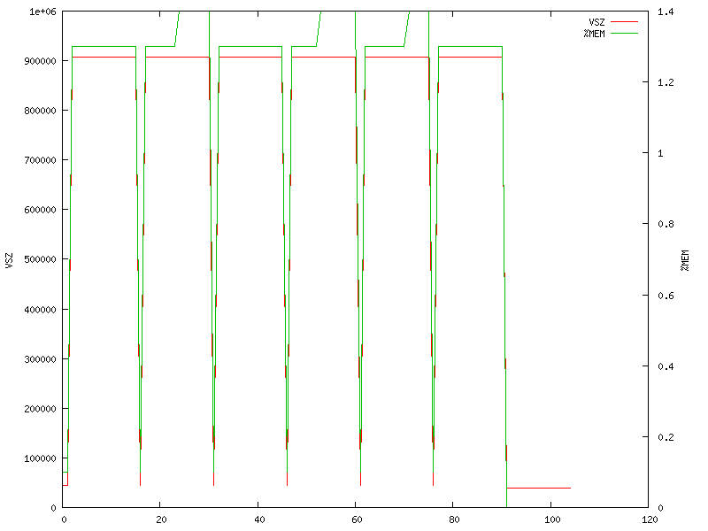

# FFmpeg - Grupo 2

## O que faz? Para que serve?
FFmpeg é uma coleção de bibliotecas e ferramentas para processar conteúdo multimídia, como áudio, vídeo, textos e metadados. Suporta vários tipos de formatos e é altamentente portátil. Iremos utilizá-lo para realizar o transcode de uma amostra de vídeo blu-ray 1080p no formato mp4 para o formato avi.

## Por que é bom para medir desempenho?
O programa é bom para medir desempenho porque é intensivo no uso de processamento multi-core, memória e acesso a disco. 

## O que baixar
É necessário clonar o [repositório do FFmpeg](https://github.com/FFmpeg/FFmpeg) e também fazer o download da [amostra de vídeo](http://downloads.dvdloc8.com/trailers/divxdigest/bourne_ultimatum_trailer.zip).

## Como compilar/instalar
Para compilar é necessário gerar os arquivos necessários com o comando:

	$ ./configure --disable-yasm
E compilar com:

	$ make

Após isso, o binário estará disponível na raiz do git, com o nome ffmpeg.
    
## Como executar
Para executar o programa com a amostra, é necessário definir alguns parâmetros padrões, logo, uma linha de comando que sintetiza é:
	
    $ ./ffmpeg -i <in>.mp4 -acodec copy -vcodec mpeg4 <out>.avi
    
## Como medir o desempenho
Para medir o desempenho, usamos:

* Page fault, cache miss, stalled
~~~
 $ perf stat -d  
 $ perf stat -r 10  
 $ perf report --stdio
~~~
* Tempo - a ferramenta perf para medir o tempo.
    
* Memória: medimos o uso de memória através de um gráfico, que será extraído e renderizado com o seguinte comando:
```sh
    #!/bin/bash
	while true; do
      ps -C ffmpeg -o pid=,%mem=,vsz= >> mem.log
      gnuplot gnuplot.script
      sleep 1
	done &
```
Além disso, é necessário ter um arquivo gnuplot.script na pasta com o seguinte conteúdo:
```sh
set term png small size 800,600
set output "mem-graph.png"

set ylabel "VSZ"
set y2label "%MEM"

set ytics nomirror
set y2tics nomirror in

set yrange [0:*]
set y2range [0:*]

plot "/tmp/mem.log" using 3 with lines axes x1y1 title "VSZ", \
     "/tmp/mem.log" using 2 with lines axes x1y2 title "%MEM"
```
O gráfico gerado é o seguinte:


Após medirmos e vermos o gráfico, chegamos a conclusão que talvez ele seja pouco útil para o benchmarking, visto que o consumo de memória é pequeno, no geral, e deve variar apenas com o vídeo.

## Passos para medição:

Primeiramente execute o perf para executar 10x o programa e tirar as medias e calcular os desvios padrões:
(executar dentro da pasta FFmpeg e alterar caminhos para in.mp4 e out.avi

	perf stat -d -r 10 ./ffmpeg -y -i  <in>.mp4 -acodec copy -vcodec mpeg4 out.avi

Quando o comando finalizar salvar as linhas que contém as seguintes palavras chave:

	page-faults
	stalled-cycles-front-end
	seconds time elapsed
	L1-dcache-load-misses
	
## Medicões base (uma máquina)
   	Quantidade           Nome da Medida                  Taxa                           Desvio

            29.618      page-faults:HG             #    0,170 K/sec                    ( +-  0,00% )
   	149.843.408.784      stalled-cycles-frontend:HG #   54,98% frontend cycles idle     ( +-  0,54% ) [57,22%]
     	2.376.902.951      L1-dcache-load-misses:HG   #    0,00% of all L1-dcache hits    ( +-  0,36% ) [71,41%]
      	29,593136593 seconds time elapsed                                                ( +- 12,30% )
